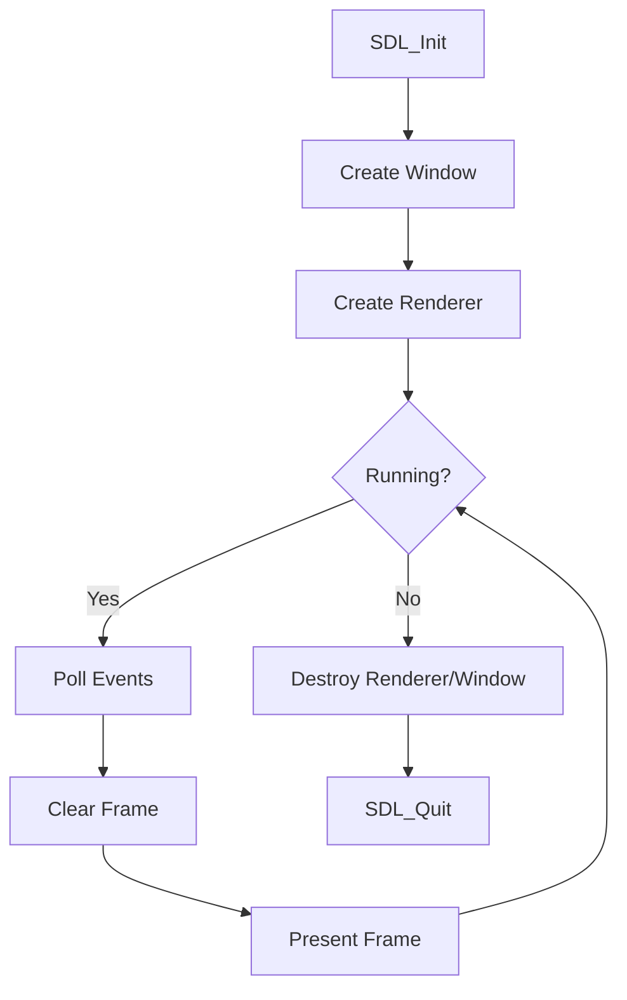

# Chess2D

> A handcrafted 2D chess experience built in C with SDL2.

[](https://en.cppreference.com/w/c/language)
[](https://www.libsdl.org/)
[](#project-status)
[](#quick-start-wsllinux)

---

## Overview

Chess2D is a learning-driven and performance-conscious chess project focused on:

- clean C architecture (modular source files, clear data flow)
- deterministic game logic (move generation and rule validation)
- responsive, minimal SDL2 rendering
- an approachable path from prototype to full chess implementation

The current build opens an SDL window, runs a render loop, and handles quit events. The project is now ready to grow into board rendering, piece rendering, and legal move logic.

---

## Project Status

### Implemented

- SDL video subsystem initialization
- 800x800 window creation
- accelerated renderer with VSync
- main event loop with `SDL_QUIT` handling
- frame clear + present cycle

### In Progress (Next Milestones)

- board model (`8x8` representation)
- board and piece rendering
- mouse input and square selection
- legal move generation and game rules

---

## Quick Start (WSL/Linux)

### 1. Install dependencies

```bash
sudo apt update
sudo apt install -y build-essential pkg-config libsdl2-dev libsdl2-image-dev libsdl2-ttf-dev
```

### 2. Build

```bash
make
```

### 3. Run

```bash
make run
```

### 4. Clean build artifacts

```bash
make clean
```

---

## Build Notes

- The Makefile currently targets WSL/Linux using `pkg-config`.
- SDL linker/compiler flags are resolved automatically through:
	- `pkg-config --cflags sdl2 SDL2_image SDL2_ttf`
	- `pkg-config --libs sdl2 SDL2_image SDL2_ttf`
- Source entry point today: `src/main.c`

---

## Project Layout

```text
Chess2D/
├── assets/                 # Textures, fonts, audio (currently empty)
├── libs/                   # Vendored SDL-related libraries/headers
├── src/
│   └── main.c              # SDL app bootstrap + main loop
├── makefile                # Build script for WSL/Linux
├── testPhases.txt          # Development phase planning notes
└── README.md               # Main project documentation
```

### Planned Internal Modules

As the project grows, source files are expected to be separated by responsibility:

- `board` for board state and initialization
- `piece` for piece types/colors and helpers
- `moves` for pseudo-legal move generation
- `rules` for legal filtering/check/checkmate logic
- `render` for board/piece/highlight drawing
- `input` for mouse interactions and turn actions

---

## Runtime Flow



---

## Development Roadmap

### Phase 1: Window and Loop

- SDL init, window, renderer, event loop
- done

### Phase 2: Board Representation

- define `Piece`, `Color`, `PieceType`, and `Board`
- initialize standard chess starting position

### Phase 3: Rendering

- draw checkered board
- load and render piece sprites

### Phase 4: Input and Selection

- map mouse coordinates to board squares
- selectable piece + highlighted destinations

### Phase 5: Move Generation

- generate piece moves by type
- add bounds checks, collisions, captures

### Phase 6: Rule Validation

- check detection
- legal move filtering (prevent self-check)

### Phase 7: Full Match Flow

- turn switching
- checkmate/stalemate detection
- promotion handling

### Phase 8: Polish

- move history, timers, audio, optional AI

---

## Documentation Design System

To keep documentation and UI direction visually consistent, use this lightweight style language:

| Element | Style Direction |
|---|---|
| Tone | Technical, concise, practical |
| Color idea | Forest (`#1B5E20`), Ivory (`#F6F1E9`), Slate (`#2F3A45`), Gold accent (`#D4A017`) |
| Typography | Monospace for code and engine data, serif or geometric sans for headings |
| Visual motif | Chessboard contrast, clear spacing, minimal ornament |

This gives the project docs an intentional identity instead of generic boilerplate.

---

## Troubleshooting

### `pkg-config` cannot find SDL packages

Install missing dev packages:

```bash
sudo apt install -y libsdl2-dev libsdl2-image-dev libsdl2-ttf-dev pkg-config
```

### Build fails with missing compiler tools

Install toolchain:

```bash
sudo apt install -y build-essential
```

### Window does not open in WSL

- ensure you are using WSLg (Windows 11) or an X server setup
- confirm graphical apps work by testing another simple SDL app

---

## Current Goal

Immediate target: render a full 8x8 board and display pieces from a sprite sheet while keeping the main loop stable and modular.

When this is complete, Chess2D transitions from platform setup to core gameplay development.